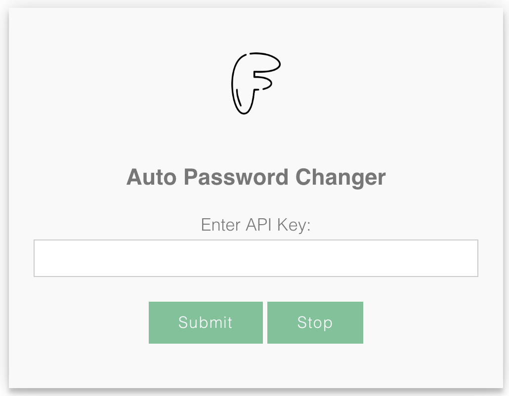

# AutoPasswordChanger
This Python-based tool simplifies the process of changing Wi-Fi passwords, generating QR codes for easy access, and provides customization options for users. It is designed to enhance Wi-Fi network security and convenience, especially for guest access.

## How It Works

1. **User Interaction**:
   - Users interact with a user-friendly graphical user interface (UI) to configure the tool.
   - Capture the Meraki API key for network access.
   - Users select the networks and specific SSID(s) they wish to manage.
   - Defining the frequency of automatic password changes.
     
     </img>
  
2. **Data Storage**:
   - User-provided information, including the API key, network selections, SSID choices, and password change frequency, is stored in a `data.json` file.
   - This configuration file serves as the tool's setup and is easily modifiable by the user either via the UI or by amending the file itself (it's recommended to use the UI).

3. **Background Operation**:
   - A script operates in the background, functioning as a scheduled task.
   - The script constantly monitors the user-defined frequency, automatically initiating API calls to change Wi-Fi passwords.
   - Passwords are securely generated and applied without requiring user intervention.

4. **QR Code Generation**:
   - After each successful password change, the script generates QR codes corresponding to the updated SSID and password combinations.
   - QR codes simplify network access for users and guests by eliminating the need for manual password entry.

5. **User Customization**:
   - Users can adjust their settings at any time through the UI.
   - Modification options include changing managed SSID(s), selecting different networks, and updating the frequency of password changes.
   - The script adapts dynamically to reflect the latest user preferences.

## Getting Started

To get started with the Wi-Fi Password Change and QR Code Generator Tool, follow these steps:

1. Clone this repository to a Ubuntu machine.
2. Install the required dependencies specified in `startup.sh`.

   ```bash
   ./startup.sh
   ```
4. Launch the tool using the provided Python script `app.py`.

   ```bash
   python3 app.py
   ```
6. Use the UI to configure your preferences and start password management and QR code generation.
7. Obtain Meraki API key [here](https://developer.cisco.com/meraki/api/#!authorization/obtaining-your-meraki-api-key).

## Use

From any browser enter http://<ip_address>:5000 or http://localhost:5000

# License

This project is licensed under the [NETDecorators] - see the [LICENSE.md](LICENSE.md) file for details.


